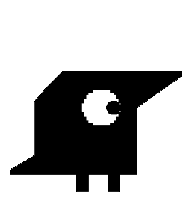
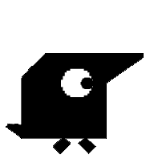
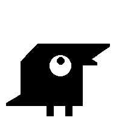
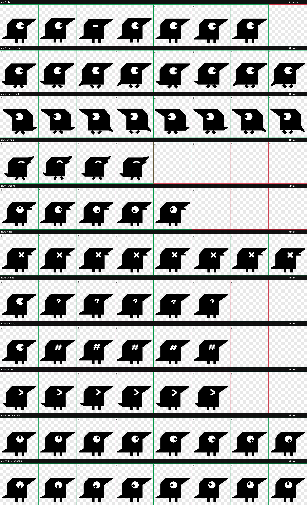

# Raven Codex Desktop Pet

Raven is a black pixel-style Codex desktop pet package. It includes idle, blink, autonomous walking, hover eye-loop, task status, approval, and output states.



## Download

Download this repository, then copy the `raven` folder into your Codex pets directory.

```sh
mkdir -p ~/.codex/pets
cp -R raven ~/.codex/pets/raven
```

After copying, restart Codex or reload the pet list.

The installed files should look like this:

```text
~/.codex/pets/raven/pet.json
~/.codex/pets/raven/spritesheet.webp
```

## Preview

Idle:


Walking:



Hover eye loop:



Full spritesheet contact sheet:



## Package Contents

```text
raven/
  pet.json
  spritesheet.webp
```

`pet.json` declares the Codex pet metadata. `spritesheet.webp` is the Codex v2 pet atlas.

## Notes

Raven was made from a user-provided pixel PNG and packaged as a Codex v2 desktop pet.

Status mappings:

- Task failed: X face
- Task complete: smile face
- Thinking/running task: # face
- Approval needed: ? face
- Response output: > face
- Hover/interaction: smooth eye-loop animation

