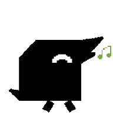
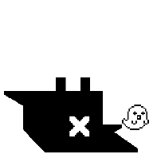
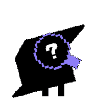
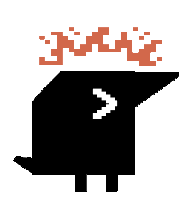

# Raven Codex Desktop Pet

Raven is a black pixel-style Codex desktop pet package. It includes idle, blink, autonomous walking, hover eye-loop, task status, approval, and output states.

Current version: `1.1.1`


## Download

Download this repository, then copy the `raven` folder into your Codex pets directory.

```sh
mkdir -p ~/.codex/pets
cp -R raven ~/.codex/pets/raven
```

After copying, restart Codex or reload the pet list.

The installed files should look like this:

```text
~/.codex/pets/raven/pet.json
~/.codex/pets/raven/spritesheet.webp
```

## Optional Renderer Patch

Raven's hover artwork contains eight pupil positions for a complete 360-degree eye loop. Some ChatGPT/Codex desktop builds play only five `jumping` frames for every pet, so the unpatched renderer cannot reach the last three positions.

For local desktop installs, `scripts/patch_custom_pet_review_hold.py` applies two custom-pet-only presentation fixes: it plays all eight hover frames and keeps a native `review` state visible for about 3.2 seconds after Codex returns to `idle`.

The patch does not synthesize task-completion events or change Codex's semantic state resolver. Built-in pets keep their stock five-frame hover behavior, and `failed`, `waiting`, `running`, or another semantic state immediately cancels the visual hold.

```sh
python3 scripts/patch_custom_pet_review_hold.py \
  /Applications/ChatGPT.app/Contents/Resources/app.asar \
  /tmp/chatgpt-app-raven-v1.1.1.asar

cp /Applications/ChatGPT.app/Contents/Resources/app.asar \
  /Applications/ChatGPT.app/Contents/Resources/app.asar.raven-completion-hold.bak

cp /tmp/chatgpt-app-raven-v1.1.1.asar \
  /Applications/ChatGPT.app/Contents/Resources/app.asar
```

Restart ChatGPT/Codex after applying the patch. App updates may replace `app.asar`, so the patch may need to be reapplied.

## Preview

Idle:


Walking:


Task complete:



Task failed or disconnected:



Hover eye loop:


Approval needed:



Thinking/running task:



Full spritesheet contact sheet:


## Package Contents

```text
raven/
  pet.json
  spritesheet.webp
```

`pet.json` declares the Codex pet metadata. `spritesheet.webp` is the Codex v2 pet atlas.

## Notes

Raven was made from a user-provided pixel PNG and packaged as a Codex v2 desktop pet.

Version `1.1.1` keeps the approved Raven artwork unchanged and adds the custom-pet renderer fix required to play the complete eight-frame hover eye loop. It also narrows completion feedback to a presentation hold after Codex has natively selected `review`.

Status mappings:

- Task failed or network disconnected: fallen X face
- Task complete: smile face with green music-note frames, alternating with review frames when Codex selects `review`
- Thinking/running task: > face with red pixel decoration
- Approval needed: ? face
- Review/output feedback: # face with yellow headphones
- Hover/interaction: smooth eye-loop animation
